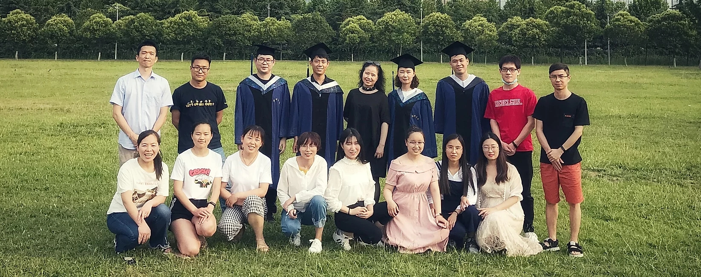

## YU, BING (於兵) Homepage

### Zhengzhou University (郑州大学) 

{:.text-muted}

	  

	    

	      

	        
	      

	      

	        
	      

	      

	        
	      

	    

	    <a class="carousel-control-prev" href="#carouselExampleControls" role="button" data-slide="prev">
	      
	      Previous
	    </a>
	    <a class="carousel-control-next" href="#carouselExampleControls" role="button" data-slide="next">
	      
	      Next
	    </a>
	  

欢迎对绿色合成化学、绿色催化研究方向感兴趣的本科生、研究生加入课题组。请发送简历至[bingyuzzu@qq.com](mailto:bingyuzzu@qq.com)
